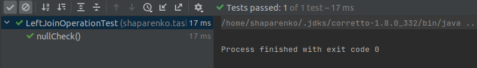
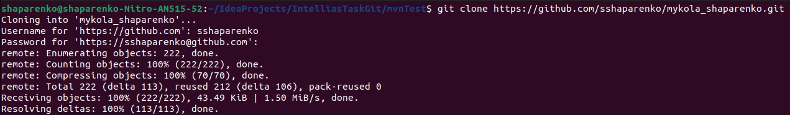
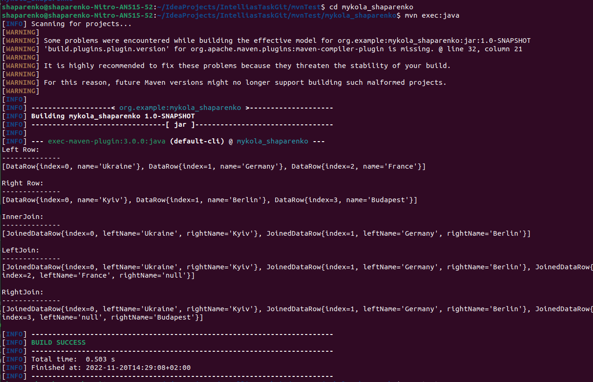
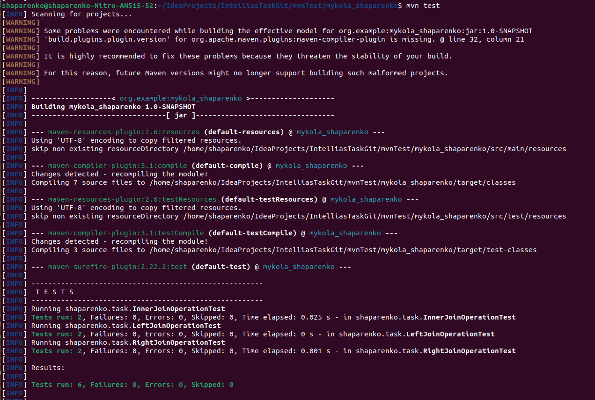

# mykola_shaparenko
### Project requirements
1. The project built with Java 1.8
2. Code is properly formatted according to the Java code conventions
3. `mvn test` — run all tests
4. `mvn exec:java` — execute project's Main method
5. The project execution possible in two commands: `git clone ...`, `mvn ...`
6. All configurations and resources are bundled in the git repository and maven `pom.xml`
---
### Project structure
The project have one base interface **JoinOperation**:
```java
public interface JoinOperation<D1, D2, R> {
    Collection<R> join(Collection<D1> leftCollection, Collection<D2> rightCollection);
}
```
- **D1** - is a generic type of the elements in the left collection 
- **D2** - is a generic type of the elements in the right collection
- **R** - is a generic type of the elements in the resulting collection

And three implementations of that interface:
- **InnerJoinOperation**
- **LeftJoinOperation**
- **RightJoinOperation**

Those implementations representing the SQL inner, left and right join.
Also, for those implementations we created two classes, that will hold the data:
```java
//K - generic type for key
//V, V1, V2 - generic type for value
DataRow<K extends Comparable<K>, V>
JoinedDataRow<K extends Comparable<K>, V1, V2>
```
---
### Testing
Tests for Left, Right and InnerJoinOperation classes was created by using JUnit5.
Those test classes are:
- InnerJoinOperationTest
- LeftJoinOperationTest
- RightJoinOperationTest

Each test class have two test methods: `joinTest()` and `nullCheck()`. 

The `joinTest()` method tests the work of the join method of inner, left or right join implementation classes.

The `nullCheck()` tests the join method with adding the `null` values to the collections on the start, middle and end.
Also, the `nullCheck()` method tests the work of join method with multiple `null` values.

**Example:**

The `nullCheck()` for LeftJoinOperation class.
```java
@Test
    void nullCheck(){
        List<DataRow<Integer, String>> leftRowListTest = new ArrayList<>();
        leftRowListTest.add(null);
        leftRowListTest.add(null);
        leftRowListTest.add(new DataRow<>(0, "Ukraine"));
        leftRowListTest.add(null);
        leftRowListTest.add(null);
        leftRowListTest.add(new DataRow<>(1, "Germany"));
        leftRowListTest.add(null);
        leftRowListTest.add(new DataRow<>(2, "France"));
        leftRowListTest.add(null);

        List<DataRow<Integer, String>> rightRowListTest = new ArrayList<>();
        leftRowListTest.add(null);
        leftRowListTest.add(null);
        rightRowListTest.add(new DataRow<>(0, "Kyiv"));
        leftRowListTest.add(null);
        leftRowListTest.add(null);
        rightRowListTest.add(new DataRow<>(1, "Berlin"));
        leftRowListTest.add(null);
        rightRowListTest.add(new DataRow<>(3, "Budapest"));
        leftRowListTest.add(null);

        List<JoinedDataRow<Integer, String, String>> joinedRowList = new ArrayList<>();
        joinedRowList.add(new JoinedDataRow<>(0, "Ukraine", "Kyiv"));
        joinedRowList.add(new JoinedDataRow<>(1, "Germany", "Berlin"));
        joinedRowList.add(new JoinedDataRow<>(2, "France", null));

        Assertions.assertEquals(joinedRowList, new LeftJoinOperation().join(leftRowListTest, rightRowListTest));
    }
```
Result of the `nullCheck()` execution:



---
### Testing the `mvn` commands

1. `mvn test` — run all tests
2. `mvn exec:java` — execute project's Main method 
3. The project execution possible in two commands: `git clone ...`, `mvn ...`

Testing `git clone ...` and `mvn exec:java`:




Testing `mvn test`:



---